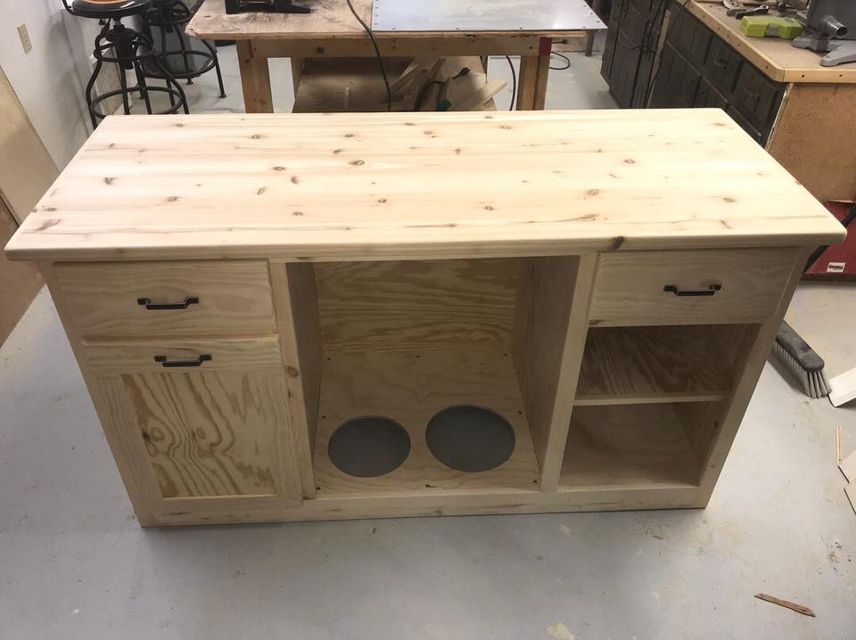
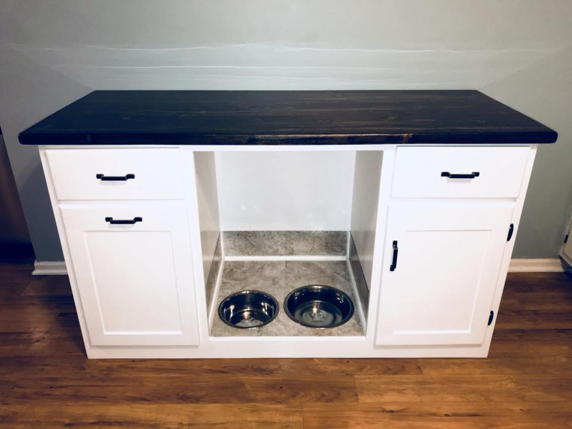
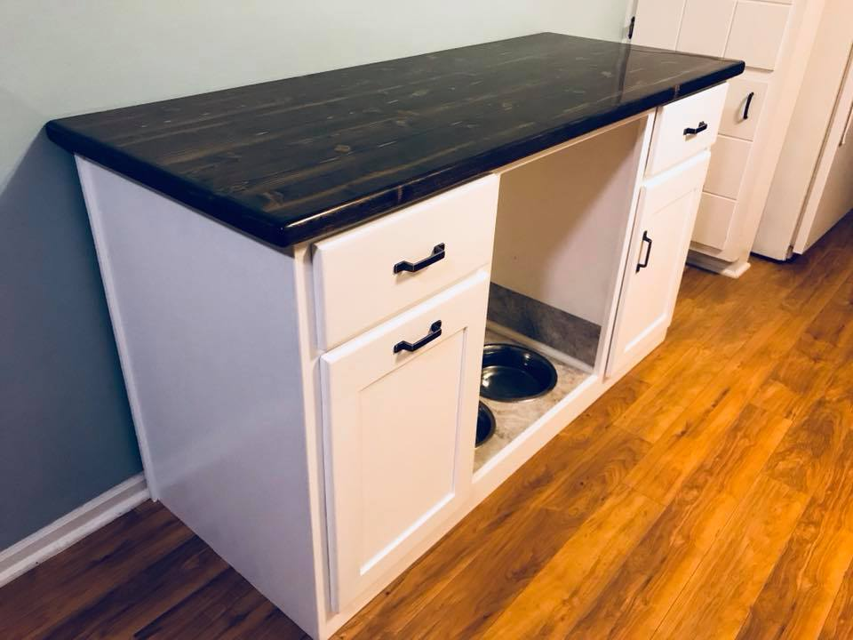
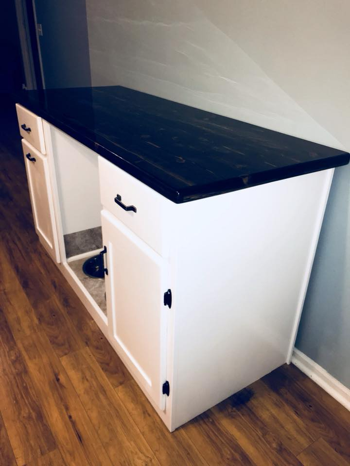
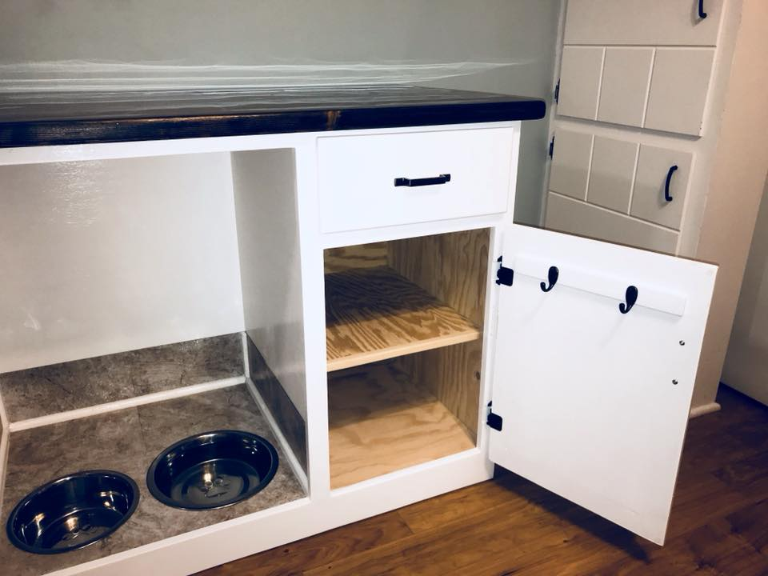
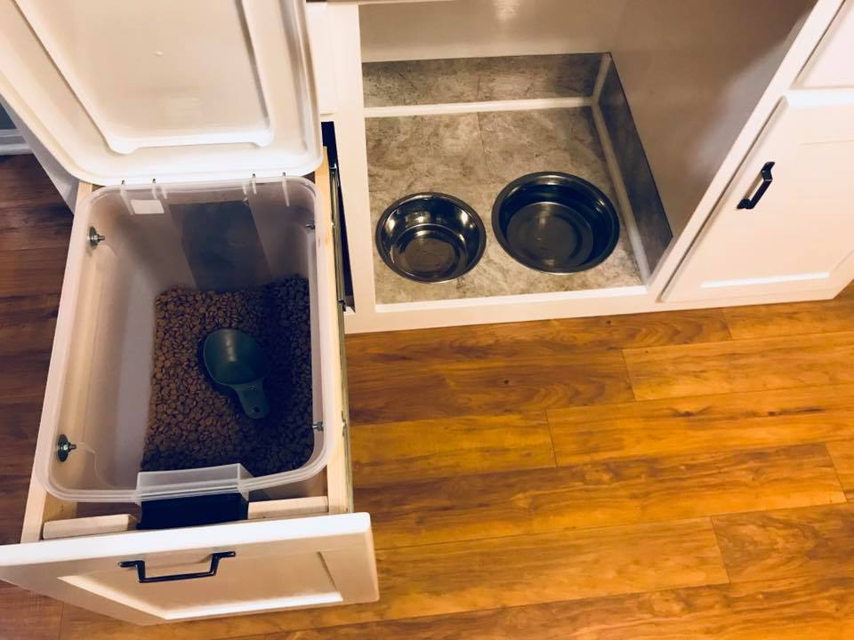
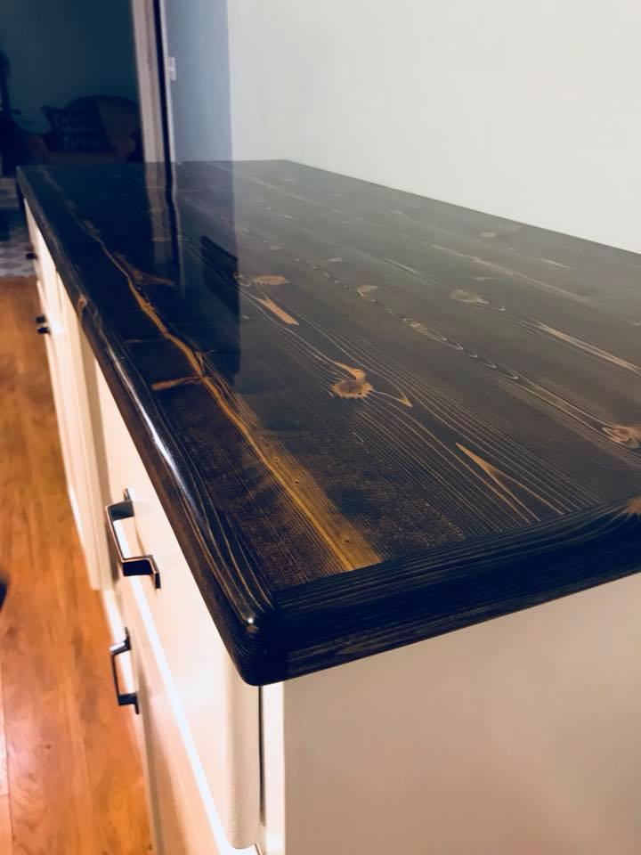
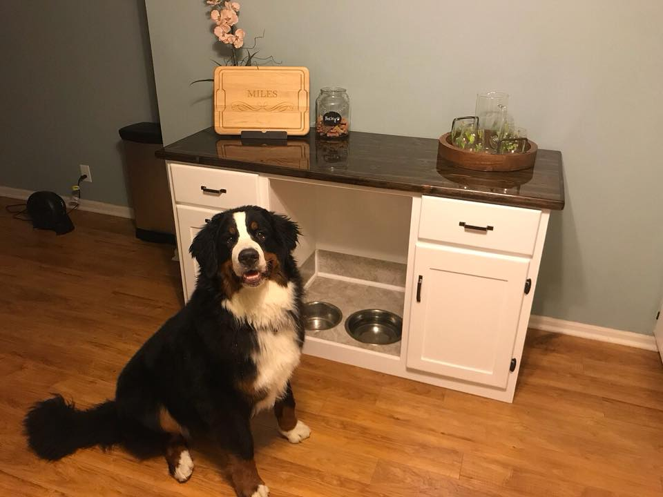

# Storage for Doggie Needs

Living with a [Berner](https://www.instagram.com/boztheberner/) can be tough. Dave built a storage container to cope.

## The Build In-Progress

# The Final Product:

### View from the left:

### View from the right:

### Look at all that storage!

### It even has Berner-Proof food storage!

### A close up of the laminate finish:

# That's One Satisfied Customer!

